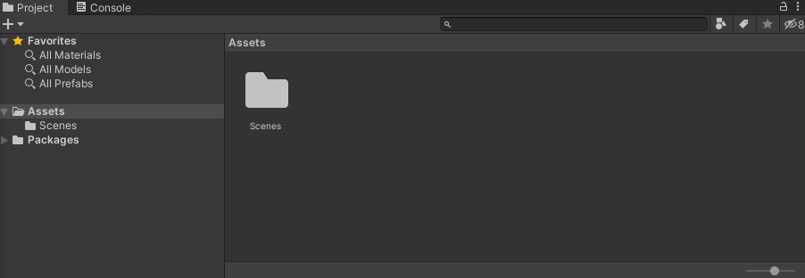
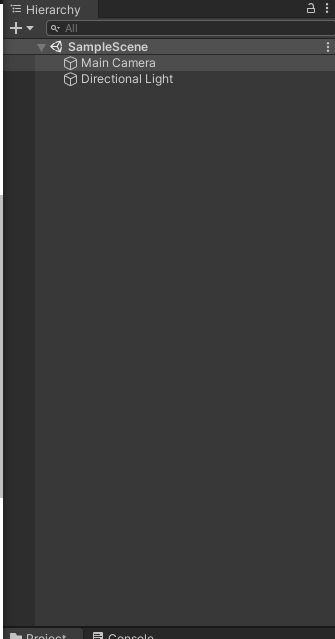
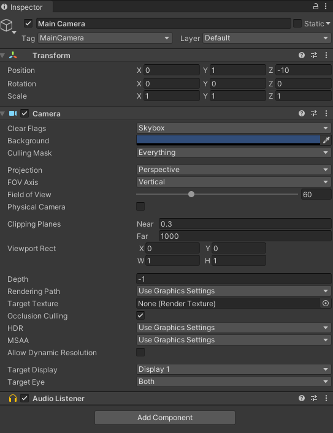
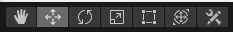
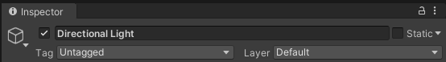
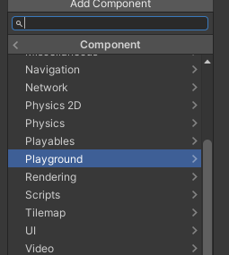

# Pondeli (Unity, Playground)
75 15 33 C0 EB 13 90
## Unity

### Window

Jednotliva okna, ktera umoznuji modifikovani a vytvareni hry. 

#### Project

Zdrojove soubory projektu, napr: modely, textury, audio, sceny atp... Soubory zde jdou nalezt primo na disku pocitace ve slozce NazevProjektu/Assets.

#### Hierarchy

Jednotlive GameObjecty ve scene. Pokud chceme pridat / odebrat GameObject tak to musim provest zde.

#### Inspector

Zobrazi detailni informace, pro upravu vybraneho souboru / GameObjectu.

##### GameObject

Detail vybraneho GameObjectu, zde jsou k nahlednuti a modifikaci jednotlive **Componenty** GameObjectu. Muzeme je pridat pomoci tlacitka Add Component / odebrat pomoci tri tecek nebo praveho clicku.

##### Soubor

Detail vybraneho souboru, napr textury. Pro kazdy soubor jsou jine moznosti.

#### Scene

Manipulacni okno s GameObjecty, zde vidime kde jsou umistene, natocene, jejich rotaci a muzeme tyto parametry upravovat. Jednotlive mody, muzeme menit v levem hornim rohu. Zleva: nic / pohyb / rotace / velikost / 2D velikost / multi ruzice (pohyb rotace scale) / custom.

#### Game

Pohled kamery, zde je presne reprezentovano, co hrac uvidi skrz kameru.

#### Asset Store

Obchod s assety a pluginy do unity, obsahuje spoustu free veci, ktere si muzete stahnout. Cokoli stazene pres store, se umisti do Project window a na disk.

---

## Jak to funguje?

Multiplatformni herni engine, pro tvorbu 2D a 3D her. Zakladnim stavebnim kamenem jsou **GameObjecty**. To jsou kontejnery s nejakym nazvem, mohou byt ruzne zanorene a spolecne tvori **Scenu**. GameObjecty maji **Componenty** coz jsou jednotlive skripty / vlastnosti daneho objektu. Napriklad fyzika, pohyb na sipky atd... 

---

### GameObjecty

Lze jim nastavit jmeno a tag + s nimi pohybovat ve scene window. **Tag** je nutny pro nektere componenty z **Playgroundu** napriklad hrac by mel mit tag **Player** Dale jim lze priradit vrstvu, o ni vice az ji budeme potrebovat.

---

### Zakladni Componenty

#### Transform

Informace o pozici, rotaci a velikosti GameObjectu. Pokud potrebujete presne hodnoty, tak je nastavte zde.

#### Collidery

Pozor na rozdeleni 2D a 3D. Nelze je kombinovat dohromady. Jsou tzv. fyzickou obalkou, pokud chceme detekovat kolize. Meli bychom vzdy vybrat co nejpresnejsi tvar, ktery se danemu objektu hodi. Napriklad pro mic kruh atp.

#### Rigidbody

Zase pozor na 2D a 3D. Povoluje fyziku danemu objektu, pokud ma collider a narazi do jineho objektu s colliderem taks e bude chovat fyzikalne spravne. Dale muzeme uzamknout jednotlive osy, napriklad pokud nechceme aby se objekt otacel, nebo vypnout gravitaci.

#### Svetlo

Nastavuje svetelne podminky sceny, jako barvu / intenzitu. Muzeme jim udelat napriklad svetlomet (spotlight typ).

#### Kamera

Kamera ve scene, kterou kouka hrac na nas vytvor. Lze prepnout mezi perspektivni a orto kamerou (perspektiva / neperspektiva). Zvysovat dohlednost, nebo treba zaber kamery.

#### Mesh

Deli se na mesh renderer a mesh filter, v nich se da upravit jaky 3D objekt se renderuje a jaky ma material.

#### Sprite

2D obrazek ve scene, ktery obsahuje informace o tom. Co za obrazek ma byt a jakou barvu, pote i order v jakem se renderuje na obrazovce = muzeme vyrvaret pozadi, popredi atp...

---

### Sceny

Jednotive sceny se daji vytvaret pomoci File/New Scene. Je dulezite ji ukladat pomoci ctrl+s. Jednotlive sceny mohou byt napr. ruzne levely hry, nebo treba hlavni menu a potom hra. Proto by vase hra mela obsahovat vice scen do kterych davate nejakou logiku. Kazda scena je ulozena na disku a lze najit v **Project** window.

---

### Prefaby

Specialni druh objektu, ktery chceme vytvaret / pouzivat opakovane. Napriklad strela z pisotle. Vytvorime ho pretazenim **GameObjectu** z hierarchie do **Projectu** tim se nam vytvori Prefab a nazev objektu zmodra. Lze ho pote z Projectu pretahnout do jakekoli sceny nebo napr spawneru z Playgroundu.

---

## Playground

Plugin / balicek **Component** a grafiky. Obsahuje zjednodusene componenty, pro tvorbu jednoduchych 2D her. Pondeli a Utery budeme travit s timto pluginem. Rozhodne nemazte zadnou slozku, vytvorenou timto balickem. Balicek bud budete mit primo v projektu, jiz od nas / budete jej moct stahnout v Asset Storu po vyhledani Playground.

Componenty z Playgroundu se daji pridat pomoci

Jednotlive componenty jsou vysvetlene ve slozce Documentation a souboru Cheatsheet.

